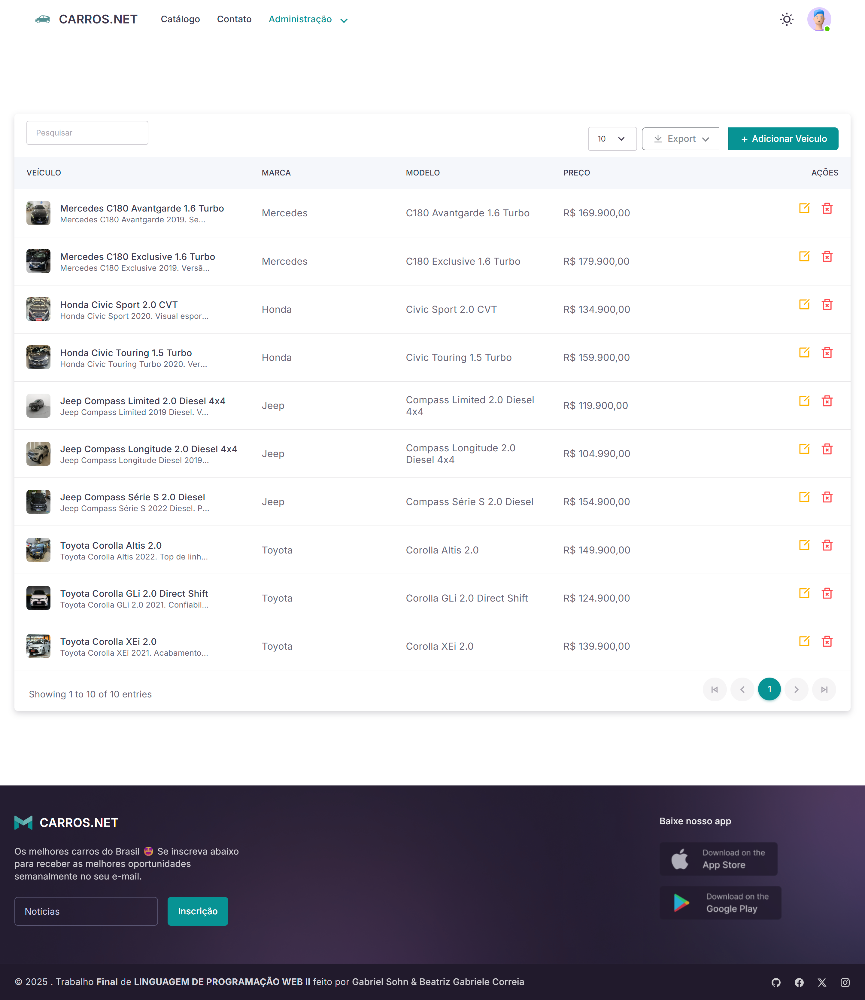
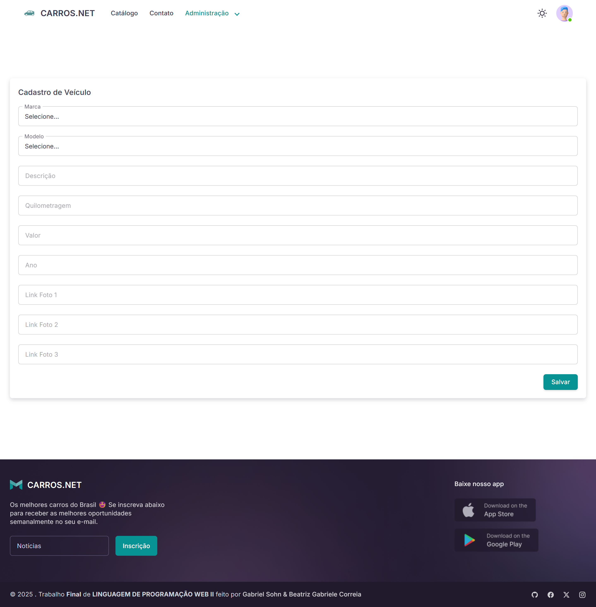
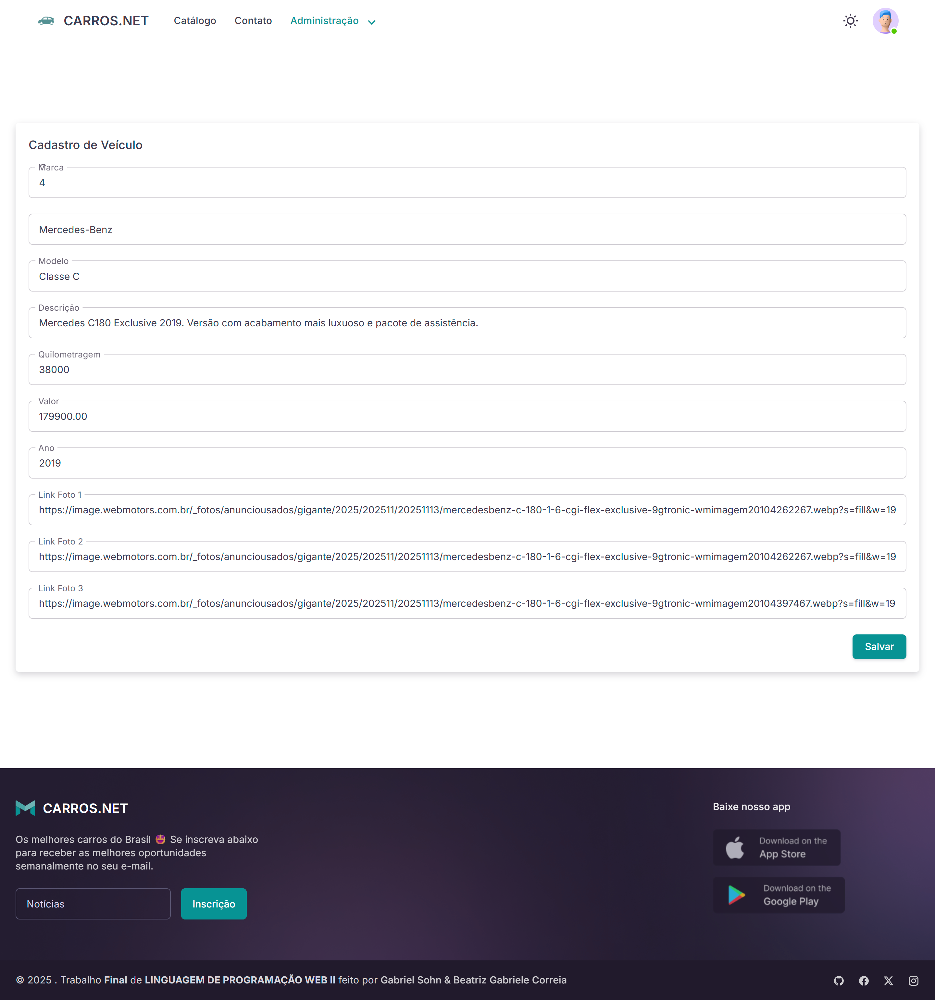
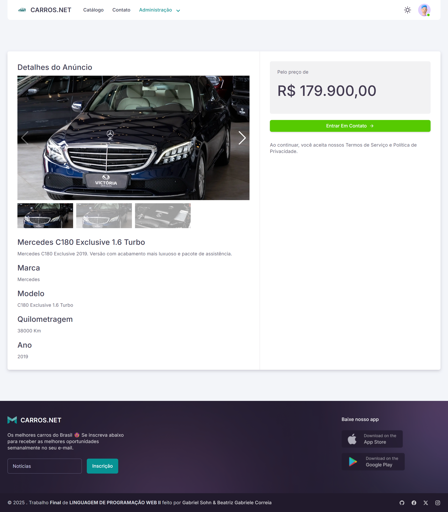
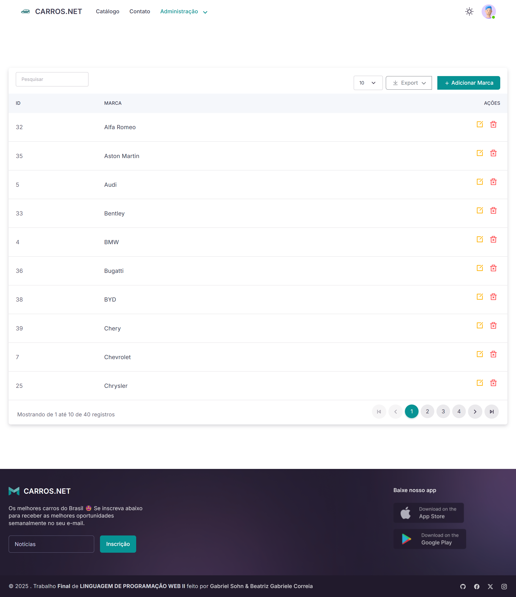
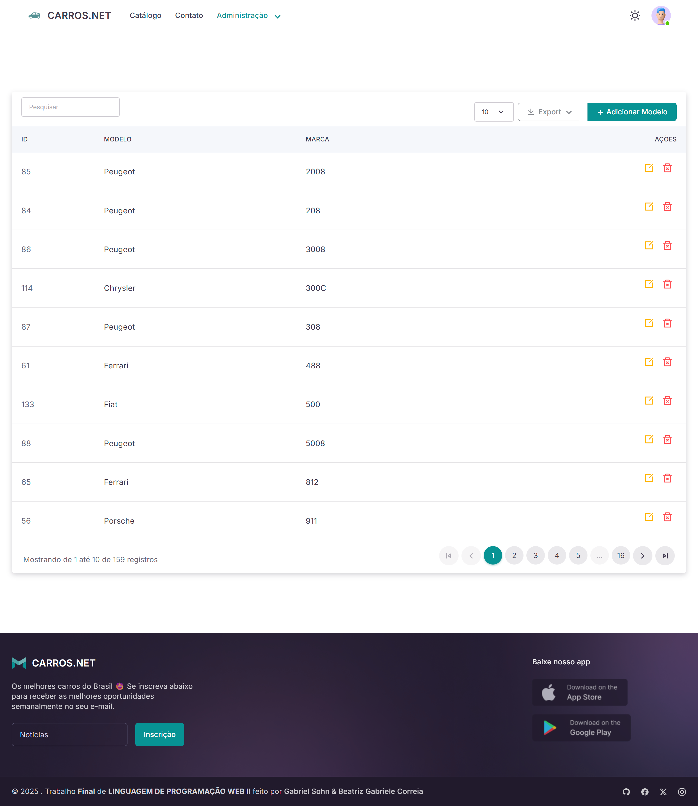
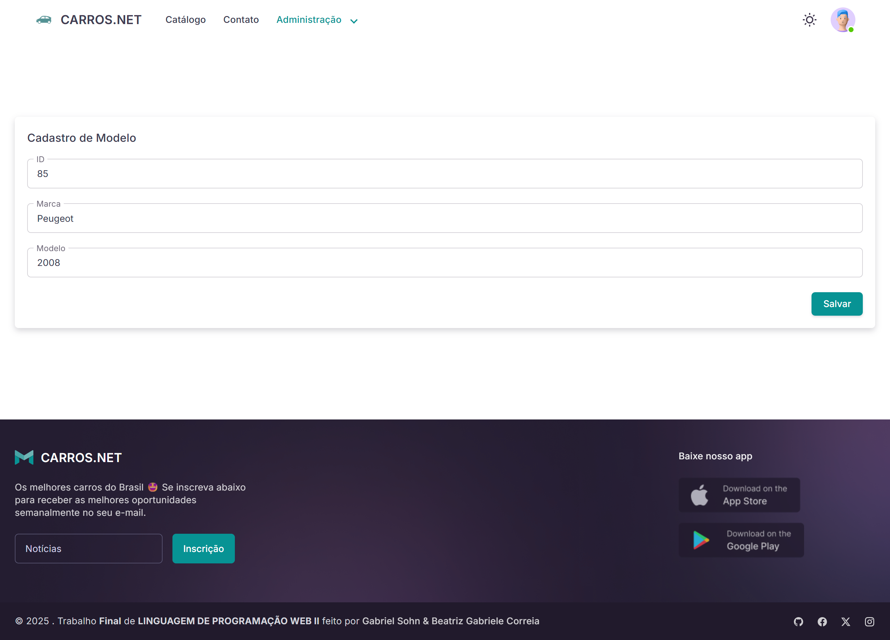
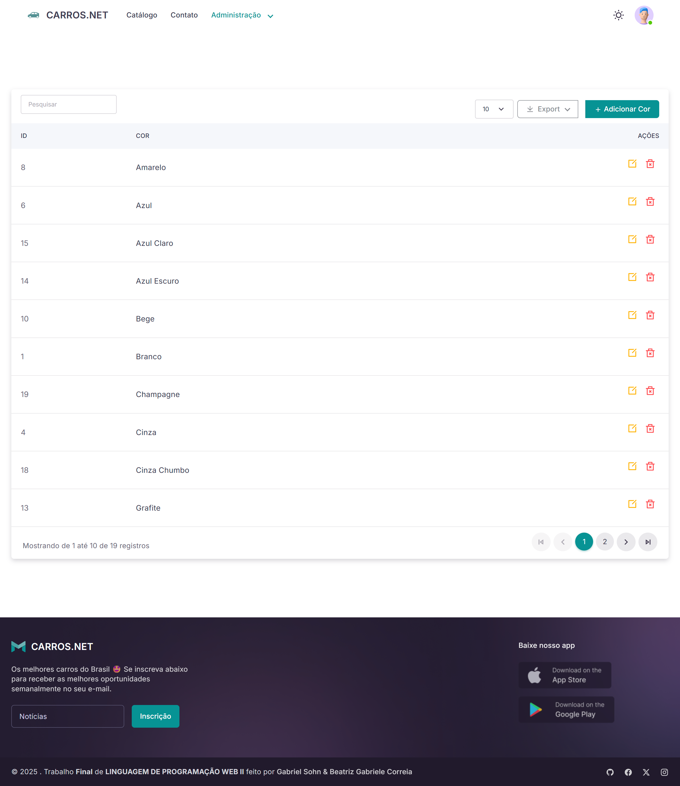
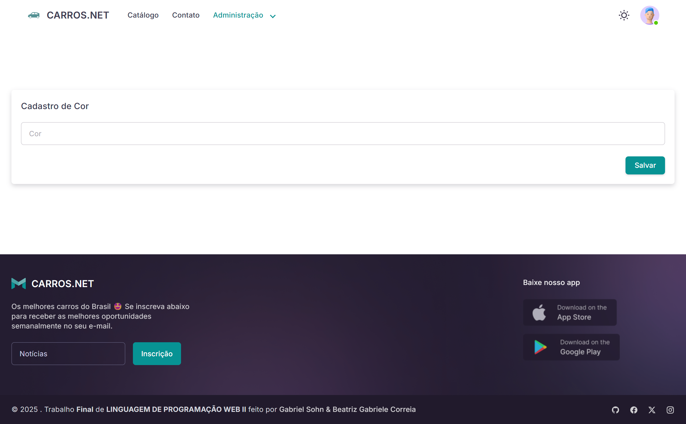
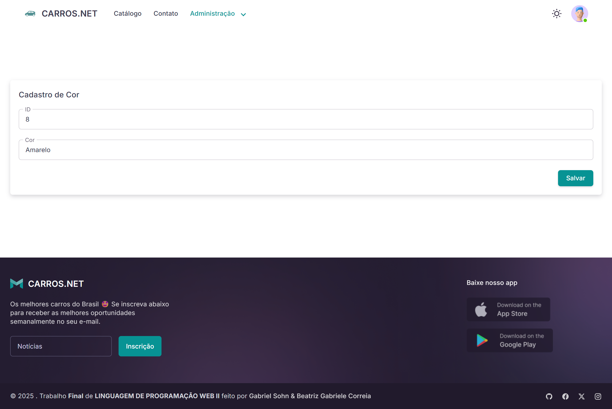

# 🏎️ Sistema de Classificados de Veículos – Laravel

Aplicação desenvolvida em Laravel para gerenciamento completo de veículos, marcas, modelos e cores, além de autenticação, cadastro, login, dark mode e detalhes de anúncio.

---

## 📌 Requisitos

- PHP >= 8.1  
- Composer  
- MySQL ou MariaDB  
- Extensões PHP comuns habilitadas

---

## 📦 1. Clonar o projeto

git clone https://github.com/gabrielsohn/laravel-ecommerce
cd laravel-ecommerce

---

## 🧩 2. Instalar dependências PHP

composer install

---

## 🎨 3. Instalar dependências frontend (se necessário)

npm install
npm run dev
# ou produção:
# npm run build

---

## ⚙️ 4. Criar e configurar o .env

cp .env.example .env

Edite o .env:

DB_CONNECTION=mysql
DB_HOST=127.0.0.1
DB_PORT=3306
DB_DATABASE=laravel
DB_USERNAME=root
DB_PASSWORD=

Gerar chave:

php artisan key:generate

---

## 🗄️ 5. Executar migrations

php artisan migrate

---

## 🚀 6. Executar o servidor

php artisan serve

A aplicação estará disponível em:
http://127.0.0.1:8000

---

## 🔐 7. Acesso

- Criar conta pela própria aplicação  
- Ou recuperar senha pela tela de "Esqueceu a Senha"

---

# 🖼️ Prints da Aplicação

## 🏠 Telas principais

### Home

### Home logada

### Login

### Criar Conta

### Esqueceu a Senha

### Dark Mode

---

## 🚗 Veículos (CRUD)

### Lista de Veículos

### Adicionar Veículo

### Editar Veículo

### Detalhes do Anúncio

---

## 🏷️ Marcas

### Lista de Marcas

### Adicionar Marca

### Editar Marca

---

## 🚘 Modelos

### Lista de Modelos

### Adicionar Modelo

### Editar Modelo

---

## 🎨 Cores

### Lista de Cores

### Adicionar Cor

### Editar Cor

---

## 📄 Licença

Projeto destinado a estudo e demonstração (trabalho final).
